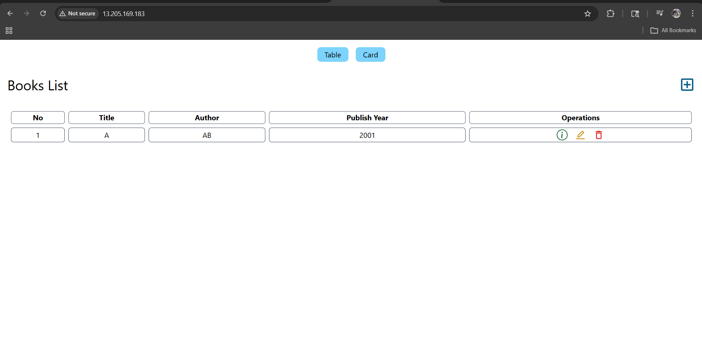
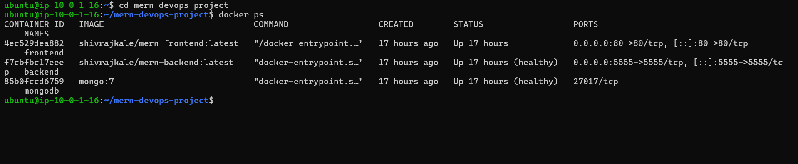
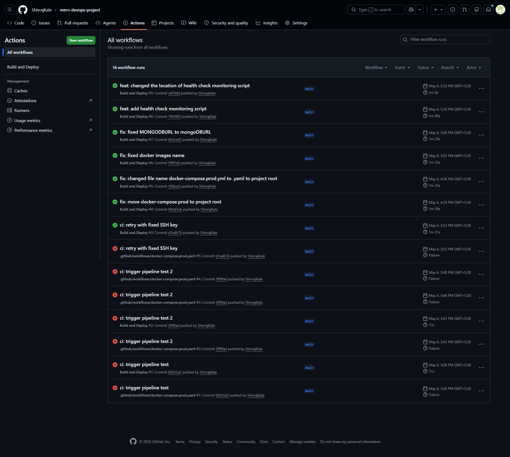
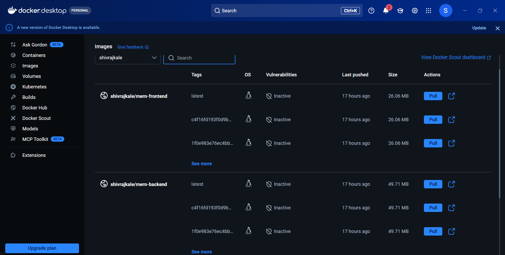

# 3-Tier MERN Application — DevOps Deployment on AWS

## 📋 Overview
Production deployment of a 3-tier MERN (MongoDB, Express, React, Nginx) bookstore
application on AWS EC2 using Terraform, Docker, and GitHub Actions CI/CD.

**My Role:** DevOps Engineer — I containerized the application, provisioned AWS
infrastructure with Terraform, configured Nginx reverse proxy, and automated
the build/deploy pipeline with GitHub Actions.

## 🏗️ Architecture
```
Internet → EC2 (Public Subnet)
             ├── Nginx + React (Frontend)  :80
             ├── Express.js (Backend API)  :5555
             └── MongoDB (Database)        :27017
           All running via Docker Compose
           Infra provisioned by Terraform
           CI/CD via GitHub Actions
```

## 🛠️ Tech Stack
| Category | Technology |
|----------|-----------|
| Cloud | AWS (VPC, EC2, EIP, Security Groups) |
| IaC | Terraform |
| Containerization | Docker, Docker Compose |
| CI/CD | GitHub Actions |
| Web Server | Nginx (reverse proxy + static files) |
| Backend | Node.js, Express.js |
| Database | MongoDB |
| Monitoring | Health check scripts, Docker health checks |

## 🚀 What I Built
1. **Terraform IaC** — VPC with public subnet, Internet Gateway, Security Groups,
   EC2 instance with Docker pre-installed via user_data script
2. **Dockerized 3-tier app** — Multi-stage Dockerfiles for frontend and backend,
   reducing image sizes by ~60%
3. **Nginx reverse proxy** — Routes `/` to React frontend, `/api/` to Express backend
4. **GitHub Actions CI/CD** — On push to main: builds images → pushes to DockerHub
   → SSH into EC2 → pulls and redeploys containers automatically
5. **Health monitoring** — Docker health checks + cron-based health check script

## 📸 Screenshots








## ⚡ Quick Start
```bash
# Clone
git clone https://github.com/ShivrajKale/mern-devops-project.git
cd mern-devops-project

# Deploy infrastructure
cd terraform && terraform init && terraform apply

# SSH into EC2 and run
docker compose up --build -d
```

## 📝 Key Decisions
- **EC2 over EKS** — Cost-effective for a single-app deployment (~$0.02/hr vs $0.10/hr)
- **DockerHub over ECR** — Free tier, simpler for public portfolio demonstration
- **Elastic IP** — Prevents IP changes on EC2 stop/start
- **Multi-stage Docker builds** — Smaller images, faster deployments
- **Separate compose files** — Dev builds locally, prod pulls from registry